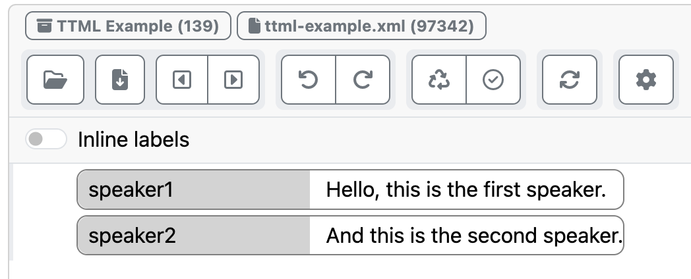
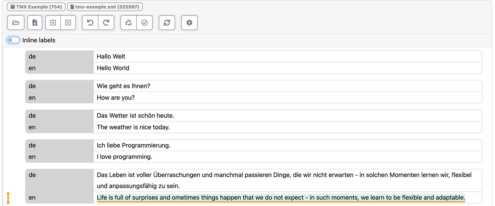

# INCEpTION Custom Format Examples

The INCEpTION text annotation format supports the definition of [custom XML formats](https://github.com/inception-project/inception/blob/main/inception/inception-io-xml/src/main/resources/META-INF/asciidoc/user-guide/formats-xml-custom.adoc).

This repository contains a few examples of custom XML formats that you can use as starting points for defining your own.

* [Timed Text Markup Language 2 (TTML)](https://www.w3.org/TR/ttml2/)
  
  
* [Translation Memory Exchange 1.4 (TMX)](https://archive.ph/20130112210434/http://www.gala-global.org/oscarStandards/tmx/tmx14b.html)
  

Note that these custom format definitions only offer limited support for the features of the respective XML specifications. 
For a more comprehensive support, it would be necessary to also implement a companion custom editor or add proper support for them to INCEpTION proper.
